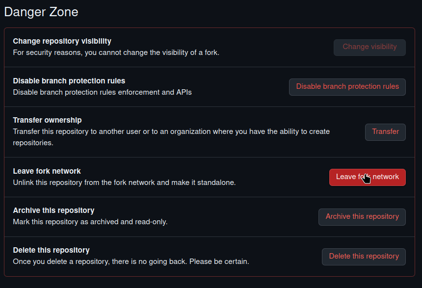
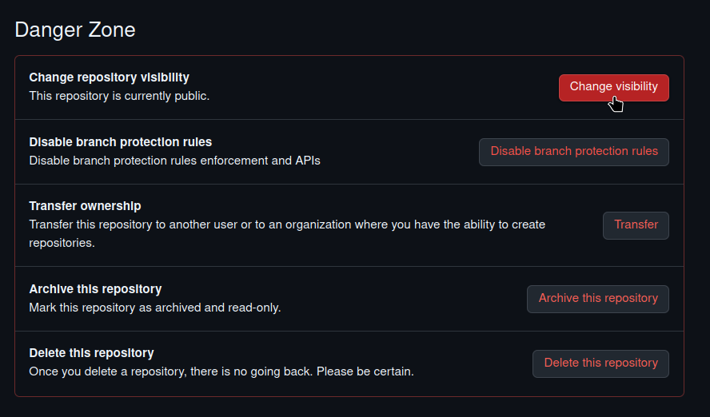
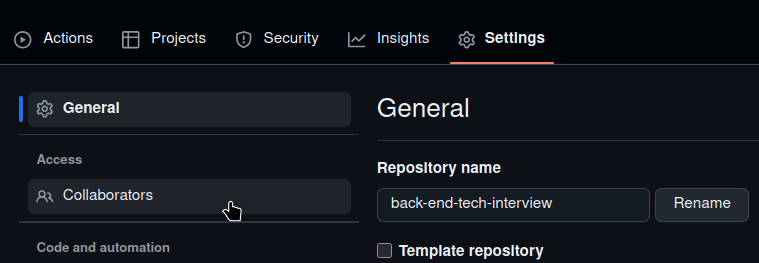
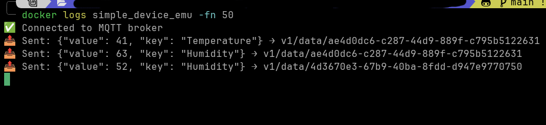

## Introduction

This document outlines a two-part technical task designed to assess your planning, development, and system integration skills. The goal is to build a small, full-stack IoT (Internet of Things) application.

You will be responsible for creating a web front-end, a backend API, a data processing service, and integrating them with a database and a provided device emulator. The project is divided into two 24-hour phases: a Review and Planning phase, followed by an Implementation phase.

Please read the Task Process and Project Details sections carefully, as they contain specific instructions on repository setup, required technologies (Python, Flask, Docker, PostgreSQL), and the expected application structure.

## First part: Review and Planning (24 hours)

This initial phase is for you to understand the project scope and plan your solution carefully before writing code.

- You will have 24 hours to review the task and prepare your approach before starting development.

-  Since protocols such as MQTT are not widely used outside the IoT field, take your time to review them if needed.

At the end of this 24-hour period, it is a plus (though not mandatory) if you share a short plan that includes:

1. ER Diagram – showing the database structure

2. List of APIs – showing endpoints and their purpose

3. System Diagram – showing how components interact

These are not mandatory but will help demonstrate your understanding and planning skills.

## Second part: Implementation (24 hours)

This is the development phase where you will build the project based on your plan.

- After completing your plan, you will have another 24 hours to implement the project.

> [!NOTE]
> We expect you to use **Lunix**
> 
> If you prefer to use another OS, you will need to adapt any provided scripts to work on your OS.

### Task process

Follow these Git and repository steps precisely to submit your work. This process ensures we can review your code in a clean, isolated environment.

1. fork the repo 
2. after forking the repo go to the forked repo setting in the end of setting page
in the bottom of the page click on (**Leave fork network**) and do the necassery steps

3. refreash the setting page after few seconds , you should see (**Change visibility**) option avaliable click , on it and do the necassery steps

4. from the top of setting page click on **Collaborators** 

5. add **omerk42** as collaborator
6. create new branch
7. work on the new branch , make sure to make atleast 3 commits with good commit massge
8. after finshing, create pull request from new branch to main , add **omerk42** as Reviewer
9. we will review your code, and call for meeting

> [!NOTE]
> The goal of the review is to ensure you understand what you built and did not rely entirely on AI-generated solutions.

### Deliverables
Your final submission must include the following items.

Required:

1. [ ] Source code (front-end, API, and service)
2. [ ] How to run project instructions

Optional (Recommended):

1. [ ] ER Diagram
2. [ ] API List
3. [ ] System Diagram

### Project detailes

This section provides the technical specifications and requirements for each component of the project.

#### repository structure

please follow this structure:
```
< project-repo >/
├── front-end/
│    └── < front-end implementation >
├── api/
│    └── < api implementation >
├── service/
│    └── < telemetry service implementation >
├── device_emulatour/
│    ├── .env.example             # example of env vars 
│    ├── device_emu.py            # logic of emulator
│    ├── dockerfile               # dockerazition of the emulator
│    ├── requirments.txt          # needed library
│    └── run.sh                   # simple script to run the docker of emulator 
├── README.md                     # Project usage instructions + documentation
└── PROJECT_TASK.md               # The task description file
```

#### 1. Front-End (Plain HTML)

Create simple HTML pages for:

1. **Login Page**
2. **User CRUD Page**
3. **Device CRUD Page**
4. **Telemetry Page**
   - Display:
     - Device Name  
     - Timestamp  
     - Value  
     - Key

#### 2. API (Flask)

Implement a Flask API with the following features:

1. **Authentication**
   - JWT-based authentication

2. **User CRUD**
   - Fields:
     - `email`
     - `username`
     - `password`

3. **Device CRUD**
   - Fields:
     - `id`: UUID
     - `name`
     - `created_at`
     - `created_by`

4. **Telemetry API**
   - Fields:
     - `device_id`
     - `value`
     - `key`
     - `timestamp`

#### 3. Database (PostgreSQL)

Use PostgreSQL to store:

- Users  
- Devices  
- Telemetry  

#### 4. Device Emulator (Provided)

The device emulator is simple script that sent random telemetry data with following structure
```json
{
"value": <random value:int>,
"key": <random key:str>
}
```
to this topic `v1/data/<devices_id>` , the device_ids will provided by you as we will explain the steps

##### Prerequisite
1. Docker
2. Running MQTT broker locally

##### run steps:

after finshing device CRUD , create multiple device
then  do the following stesp

1. add device ids in `.env` as shown in `.env.example`
2. run device_emulatour/run.sh
3. this should create docker container with name `simple_device_emu`
4. check log of the container
> docker logs simple_device_emu -fn 50

the result should be smiller to shown 


5. now you can work on telemetry store service 

#### 5. telemetry store service

Implement service that:

- Receives telemetry messages  
- Stores them in the database
